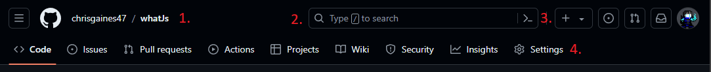

#  whatJs 💥💥💥 absurdly small and powerful 💥💥💥 javascript framework

    See my website (completely coded in what)
  <table>
    <tbody>
      <tr>
        <td>
          <a href="">website</a>
        </td>
        <td>
          <a href="">Tutorial</a>
        </td>
        <td>
          <a href="">Fully built website examples</a>
        </td>
        <td>
          <a href="">whatJs playground</a>
        </td>
      </tr>
    </tbody>
  </table>

# Contents
 - [WhatJs]()
    - [What](#whatisthis)
    - [Why](#whyusethis)
    - [How](#howtouse)
 - [Tutorial](#tutorial) 

whatJs is a proxy based javascript framework I built to facilitate react-like development without what I consider to be the main pain points of react

## Why use this
whatJs is extremely small coming in under 2kb, vs the react equivalent (react + react-dom) 44.4kb as of 6/27/2024
whatJs can be used inside or with any other javascript library/framework where you can access the DOM (including react)
whatJs is easy to write and understand, without needing to change the way you code
wh

## Examples

  
<strong>Github</strong>

  This section walks through building this page you are currently on (github.com) in whatJs
 
  
Lets write components for the different parts of the header.

  
  
1. LinkNav -> Group of links: vertical navigation, dashboard, user, repository

  
2. SearchNav -> Search feature

  
3. ActionNav -> Action buttons

  
4. PageNav -> Page navigation

  
5. VertNav -> Vertical navigation

  

  css:
  #link-nav {
    flex: 1 1 auto;
      display: flex;
      gap: var(--base-size-8, 8px);
  }
  

  
Core App Structure

    function LinkNav() {

      return dom.div({id: 'link-nav'}, [
        dom.div({id: 'vert-nav-link'}, [

        ]),
        dom.div({id: 'dashboard-link'}, [

        ])
      ])
    }

    function SearchNav() {

      return dom.div();
    }

    function ActionNav() {

      return dom.div();
    }

    function PageNav() {

      return dom.div();
    }

    function VertNav() {

      return dom.div();
    }

    dom.div({render: 'body', id: 'header'},[
      LinkNav(),
      dom.SearchNav(),
      dom.ActionNav(),
      dom.PageNav(),
      dom.VertNav()
    ])
  

  

